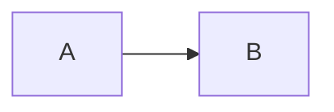

# 📋 WeCan Wiki 快速参考卡

## 🚀 快速命令

### 部署
```bash
./deploy.sh                    # 一键部署
docker-compose ps              # 查看服务状态
docker-compose logs -f         # 查看日志
```

### 开发
```bash
cd frontend && npm run dev     # 启动前端 (3000)
cd backend && npm run dev      # 启动后端 (3001)
```

### 运维
```bash
docker-compose restart         # 重启服务
docker-compose down            # 停止服务
./scripts/backup.sh            # 备份数据
./scripts/restore.sh <file>    # 恢复数据
```

---

## 🔑 默认配置

| 项目 | 值 |
|------|-----|
| **首页** | http://localhost |
| **管理后台** | http://localhost/admin |
| **API** | http://localhost/api/v1 |
| **用户名** | admin |
| **密码** | admin123 |

---

## 📁 目录结构

```
WeCan/
├── README.md              # 主文档
├── QUICKSTART.md          # 快速入门
├── DEPLOYMENT.md          # 部署指南
├── PROJECT_STRUCTURE.md   # 项目结构
├── DELIVERY.md            # 交付清单
├── PROJECT_SUMMARY.md     # 项目总结
│
├── docker-compose.yml     # Docker 配置
├── .env.example           # 环境变量
├── deploy.sh              # 部署脚本
│
├── frontend/              # 前端 Next.js
│   ├── src/
│   │   ├── app/           # 页面
│   │   ├── components/    # 组件
│   │   └── lib/           # 工具
│   └── package.json
│
├── backend/               # 后端 Node.js
│   ├── src/
│   │   ├── models/        # 数据模型
│   │   ├── routes/        # API 路由
│   │   └── controllers/   # 控制器
│   └── package.json
│
├── nginx/                 # Nginx 配置
├── mongodb/               # MongoDB 初始化
└── scripts/               # 工具脚本
```

---

## 🗄️ 数据模型

### Document (文档)
```javascript
{
  title, slug, content,
  categoryId, tags[], authorId,
  status: 'draft'|'published'|'archived',
  version, viewCount, likeCount
}
```

### Category (分类)
```javascript
{
  name, slug, parentId,
  path, order, icon,
  description, depth
}
```

### User (用户)
```javascript
{
  username, email, password,
  role: 'super_admin'|'admin'|'editor'|'author'|'viewer',
  avatar, bio, socialLinks
}
```

### Tag (标签)
```javascript
{
  name, slug, color, count
}
```

---

## 🔌 API 接口

### 文档
```
GET    /api/v1/documents          # 列表
POST   /api/v1/documents          # 创建
GET    /api/v1/documents/:slug    # 详情
PUT    /api/v1/documents/:id      # 更新
DELETE /api/v1/documents/:id      # 删除
```

### 分类
```
GET    /api/v1/categories         # 获取分类树
POST   /api/v1/categories         # 创建分类
PUT    /api/v1/categories/:id     # 更新
DELETE /api/v1/categories/:id     # 删除
```

### 搜索
```
GET    /api/v1/search?q=keyword   # 搜索
```

### 认证
```
POST   /api/v1/auth/login         # 登录
POST   /api/v1/auth/register      # 注册
POST   /api/v1/auth/logout        # 登出
```

---

## 🎨 Markdown 语法

```markdown
# 标题
**粗体** *斜体* ~~删除线~~

- 无序列表
- 无序列表

1. 有序列表
2. 有序列表

[链接文本](URL)


> 引用文本

`行内代码`

```语言
代码块
```

| 表头 | 表头 |
|------|------|
| 单元格 | 单元格 |

- [ ] 任务列表
- [x] 已完成



$$ 数学公式 $$
```

---

## 🛠️ 技术栈

### 前端
- Next.js 14 (App Router)
- TypeScript 5.x
- Tailwind CSS
- Shadcn/ui
- Zustand
- React Markdown

### 后端
- Node.js 20
- Koa.js
- Mongoose
- JWT
- MeiliSearch

### 基础设施
- Docker & Docker Compose
- MongoDB 7.x
- Nginx
- MinIO

---

## 📊 知识分类

```
📚 基础理论          💻 编程语言         🌐 Web 开发
🗄️ 数据库           ☁️ 云计算与 DevOps   🔒 网络安全
📱 移动开发         🤖 人工智能         🛠️ 开发工具
📋 项目管理         💼 职场与发展
```

---

## 👥 权限系统

| 角色 | 权限 |
|------|------|
| **Super Admin** | 所有权限 |
| **Admin** | 除系统设置外的所有权限 |
| **Editor** | 内容创作和编辑 |
| **Author** | 仅自己的文档 |
| **Viewer** | 只读 |

---

## 🔧 常见问题

### Q: 如何重置密码？
```bash
docker-compose exec mongodb mongosh
use wikan
db.users.updateOne(
  { username: "admin" },
  { $set: { password: "$2a$10$LgQkXhQ5Z5Z5Z5Z5Z5Z5Z5Z5Z5Z5Z5Z5Z5Z5Z5Z5Z5Z5Z5Z5Z5Z5Z" } }
)
# 新密码：admin123
```

### Q: 端口被占用？
修改 `docker-compose.yml`:
```yaml
ports:
  - "8080:80"  # 改为 8080
```

### Q: 如何备份？
```bash
./scripts/backup.sh
```

### Q: 查看日志？
```bash
docker-compose logs -f
```

---

## 📖 文档导航

1. **[README.md](README.md)** - 完整的项目说明
2. **[QUICKSTART.md](QUICKSTART.md)** - 5 分钟快速上手
3. **[DEPLOYMENT.md](DEPLOYMENT.md)** - 详细部署指南
4. **[PROJECT_STRUCTURE.md](PROJECT_STRUCTURE.md)** - 项目结构详解
5. **[DELIVERY.md](DELIVERY.md)** - 项目交付清单
6. **[PROJECT_SUMMARY.md](PROJECT_SUMMARY.md)** - 项目总结

---

## 🆘 获取帮助

- 📖 阅读文档
- 🐛 提交 Issue
- 📧 Email: support@wikan.com

---

<div align="center">

**祝你使用愉快！** ✨

Made with ❤️ by WeCan Team

</div>
