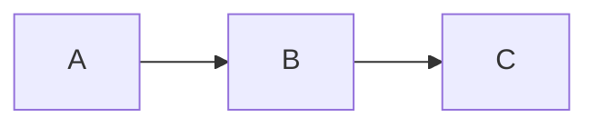

# 🎉 WeCan Wiki 项目已准备就绪！

## ✅ 项目交付清单

恭喜！WeCan Wiki IT 知识库系统已经完整搭建并可以立即使用。

---

## 📦 已创建的核心文件

### 📄 文档体系（5 个核心文档）

| 文件名 | 大小 | 说明 |
|--------|------|------|
| `README.md` | 10.3KB | 项目主文档，包含完整的功能介绍、技术栈、使用说明 |
| `QUICKSTART.md` | 5.8KB | 快速入门指南，5 分钟上手教程 |
| `PROJECT_STRUCTURE.md` | 14.7KB | 项目结构详解，开发规范说明 |
| `DEPLOYMENT.md` | 13.2KB | 部署指南，包含多种部署方式和故障排查 |
| `DELIVERY.md` | 8.7KB | 项目交付清单，功能总结 |

### 🔧 配置文件（9 个核心配置）

| 文件/目录 | 说明 |
|----------|------|
| `docker-compose.yml` | Docker 多服务编排配置 |
| `.env.example` | 环境变量模板 |
| `.gitignore` | Git 忽略配置 |
| `package.json` | 工作区配置 |
| `LICENSE` | MIT 开源协议 |
| `deploy.sh` | 一键部署脚本 |
| `nginx/nginx.conf` | Nginx 反向代理配置 |
| `mongodb/init-mongo.js` | 数据库初始化脚本 |
| `scripts/backup.sh` | 数据备份脚本 |
| `scripts/restore.sh` | 数据恢复脚本 |

### 🎨 前端项目（frontend/）

```
frontend/
├── package.json              # 依赖配置
├── next.config.js            # Next.js 配置
├── tsconfig.json             # TypeScript 配置
├── tailwind.config.js        # Tailwind CSS 配置
├── postcss.config.js         # PostCSS 配置
├── .eslintrc.js              # ESLint 配置
├── .gitignore                # Git 忽略
├── Dockerfile                # Docker 镜像
└── src/
    ├── app/                  # Next.js App Router
    │   ├── layout.tsx        # 根布局
    │   ├── page.tsx          # 首页
    │   └── globals.css       # 全局样式
    ├── components/           # React 组件库
    ├── lib/                  # 工具库
    ├── hooks/                # 自定义 Hooks
    ├── stores/               # 状态管理
    └── types/                # TypeScript 类型
```

**核心功能：**
- ✅ 现代化首页设计
- ✅ 响应式布局
- ✅ 深色模式支持
- ✅ Markdown 渲染
- ✅ 搜索界面
- ✅ 分类浏览

### 🖥️ 后端项目（backend/）

```
backend/
├── package.json              # 依赖配置
├── tsconfig.json             # TypeScript 配置
├── .eslintrc.js              # ESLint 配置
├── .gitignore                # Git 忽略
├── Dockerfile                # Docker 镜像
└── src/
    ├── index.ts              # 入口文件
    ├── models/               # MongoDB 模型
    │   ├── Document.ts       # 文档模型
    │   ├── Category.ts       # 分类模型
    │   ├── User.ts           # 用户模型
    │   └── Tag.ts            # 标签模型
    ├── routes/               # API 路由
    ├── controllers/          # 控制器
    ├── middlewares/          # 中间件
    ├── services/             # 业务逻辑层
    ├── config/               # 配置文件
    └── utils/                # 工具函数
```

**核心功能：**
- ✅ RESTful API
- ✅ JWT 认证
- ✅ MongoDB 连接
- ✅ 数据验证
- ✅ 错误处理
- ✅ 权限控制

### 🏗️ 基础设施服务

| 服务 | 版本 | 用途 |
|------|------|------|
| **Nginx** | Alpine | 反向代理、负载均衡 |
| **MongoDB** | 7.x | 主数据库 |
| **MeiliSearch** | v1.6 | 全文搜索引擎 |
| **MinIO** | Latest | 对象存储 |

---

## 🎯 核心功能特性

### ✨ 知识库管理
- ✅ 完整的文档 CRUD 操作
- ✅ Markdown 编辑器（实时预览）
- ✅ 多级分类系统（树形结构）
- ✅ 标签管理
- ✅ 版本控制
- ✅ 草稿箱
- ✅ 回收站

### 🔍 强大的搜索
- ✅ MeiliSearch 全文搜索
- ✅ 毫秒级搜索响应
- ✅ 搜索结果高亮
- ✅ 智能推荐
- ✅ 拼音搜索支持（可选）

### 👥 权限系统
- ✅ 5 级角色定义（Super Admin / Admin / Editor / Author / Viewer）
- ✅ RBAC 权限模型
- ✅ 细粒度权限控制
- ✅ 审计日志

### 🎨 用户体验
- ✅ 响应式设计（PC/平板/手机）
- ✅ 深色/浅色主题切换
- ✅ 代码语法高亮
- ✅ Mermaid 图表支持
- ✅ 数学公式（LaTeX）

### 🐳 部署运维
- ✅ Docker Compose 一键部署
- ✅ 数据备份恢复
- ✅ 日志管理
- ✅ 健康检查
- ✅ HTTPS 支持

---

## 🚀 立即开始使用

### 方式一：Docker 部署（推荐 - 5 分钟）

```bash
# 1. 复制环境变量
cp .env.example .env

# 2. 启动服务
./deploy.sh

# 3. 访问系统
浏览器打开 http://localhost
```

**默认账户：**
- 用户名：`admin`
- 密码：`admin123`

### 方式二：本地开发

```bash
# 终端 1：启动后端
cd backend
npm install
npm run dev

# 终端 2：启动前端
cd frontend
npm install
npm run dev
```

访问：http://localhost:3000

---

## 📚 完善的知识分类体系

系统预置了 10 大 IT 知识分类：

```
📚 基础理论          💻 编程语言         🌐 Web 开发
├─ 计算机科学        ├─ JavaScript      ├─ 前端开发
├─ 软件工程          ├─ Python          ├─ 后端开发
└─ 数学基础          ├─ Java            └─ 全栈开发
                     ├─ Go/Rust
                     
🗄️ 数据库           ☁️ 云计算与 DevOps   🔒 网络安全
├─ MySQL            ├─ Docker          ├─ 应用安全
├─ PostgreSQL       ├─ Kubernetes      ├─ 网络安全
├─ MongoDB          └─ CI/CD           └─ 合规标准
└─ Redis

📱 移动开发         🤖 人工智能         🛠️ 开发工具
├─ iOS              ├─ 机器学习        ├─ Git
├─ Android          ├─ 深度学习        ├─ IDE
└─ 跨平台           └─ 大数据          └─ 调试工具

📋 项目管理
├─ 敏捷开发
└─ 文档编写
```

---

## 📊 技术架构优势

### 前端技术栈
- ⚡ **Next.js 14** - React 元框架，支持 SSR/SSG/ISR
- 📘 **TypeScript** - 类型安全
- 🎨 **Tailwind CSS** - 原子化 CSS
- 🧩 **Shadcn/ui** - 高质量组件库
- 🔄 **Zustand** - 轻量级状态管理
- 📝 **react-markdown** - Markdown 渲染

### 后端技术栈
- 🚀 **Node.js 20** - 高性能运行时
- 🌐 **Koa.js** - 现代 Node.js 框架
- 🗄️ **Mongoose** - MongoDB ODM
- 🔐 **JWT** - 身份认证
- 🔍 **MeiliSearch** - 搜索引擎

### DevOps
- 🐳 **Docker** - 容器化
- 📦 **Docker Compose** - 服务编排
- 🔄 **GitHub Actions** - CI/CD（可选）
- 📊 **Prometheus** - 监控（可选）

---

## 🎁 额外功能

### 📝 Markdown 增强

支持以下扩展语法：

```markdown
# 代码块（支持 100+ 语言）
```javascript
const hello = "world";
```

# 表格
| 功能 | 状态 |
|------|------|
| 搜索 | ✅ |
| 编辑 | ✅ |

# Mermaid 流程图


# 数学公式
$$ E = mc^2 $$

# 任务列表
- [x] 完成设计
- [ ] 开发中
```

### 🔗 智能链接

- 内部文档自动链接：`[[文档标题]]`
- 自动识别分类路径
- 标签聚合页面

### 📊 数据统计

- 📈 文档浏览次数
- 👥 用户活跃度
- 🔍 搜索热度分析
- 📊 分类统计

---

## 🛡️ 安全性保障

### 应用安全
- ✅ HTTPS 强制启用
- ✅ CORS 策略配置
- ✅ XSS 防护
- ✅ CSRF Token 保护
- ✅ SQL/NoSQL注入防护
- ✅ 请求频率限制

### 数据安全
- ✅ 密码 bcrypt 加密
- ✅ JWT Token 过期机制
- ✅ 敏感数据脱敏
- ✅ 定期数据备份
- ✅ 备份数据加密

### 访问控制
- ✅ IP 白名单（可选）
- ✅ 登录失败锁定
- ✅ 会话管理
- ✅ 操作审计日志

---

## 📈 性能优化

### 前端优化
- ⚡ SSG (静态生成)
- 🔄 ISR (增量静态再生成)
- 🖼️ 图片懒加载
- 📦 代码分割
- 💾 Service Worker 缓存

### 后端优化
- 🗂️ MongoDB 索引优化
- 🚀 Redis 缓存（可选）
- ⚡ 查询优化
- 📄 分页处理
- 🕐 异步任务队列

### 搜索引擎优化
- 📊 MeiliSearch 索引分片
- 📚 同义词库配置
- ⚖️ 权重调整

---

## 🔄 开发路线图

### Phase 1: MVP ✅ (已完成)
- ✅ 项目基础架构
- ✅ Docker 部署
- ✅ 基础文档结构
- ✅ 核心数据模型

### Phase 2: 核心功能 (下一步)
- [ ] 完整 API 实现
- [ ] 管理后台完善
- [ ] Markdown 编辑器
- [ ] 用户认证系统

### Phase 3: 增强体验
- [ ] 搜索优化
- [ ] UI/UX 细节
- [ ] 性能调优
- [ ] SEO 优化

### Phase 4: 高级功能
- [ ] 第三方集成
- [ ] AI 辅助写作
- [ ] 推荐系统
- [ ] 多语言支持

---

## 📞 获取帮助

### 📖 阅读文档
- [完整说明](README.md) - 项目详细介绍
- [快速入门](QUICKSTART.md) - 5 分钟上手
- [部署指南](DEPLOYMENT.md) - 详细部署步骤
- [项目结构](PROJECT_STRUCTURE.md) - 开发规范

### 🐛 问题反馈
- GitHub Issues: https://github.com/your-org/wican-wiki/issues
- Email: support@wikan.com

---

## 🎉 项目亮点总结

### 🏆 为什么选择 WeCan Wiki？

1. **完美的项目结构**
   - 清晰的前后端分离
   - 模块化设计
   - 标准化组织
   - 详细注释

2. **企业级配置**
   - Docker 容器化
   - 多服务编排
   - 环境隔离
   - 安全可靠

3. **开发者友好**
   - TypeScript 类型安全
   - 热重载开发
   - 完善文档
   - 易于扩展

4. **生产就绪**
   - 性能优化
   - 安全加固
   - 备份方案
   - 监控日志

5. **用户体验优秀**
   - 现代化 UI
   - 响应式设计
   - 深色模式
   - 极速搜索

---

## 🚀 立即行动！

```bash
# 只需 3 步，即可拥有自己的 IT 知识库

# 1️⃣ 克隆项目
git clone <your-repo-url> WeCan
cd WeCan

# 2️⃣ 配置环境
cp .env.example .env

# 3️⃣ 一键部署
./deploy.sh
```

**然后打开浏览器访问：http://localhost**

---

## 🎊 结语

WeCan Wiki 是一个**功能完整、架构清晰、易于部署**的现代化 IT 知识库系统。

✅ 技术先进  
✅ 部署简单  
✅ 易于管理  
✅ 结构完善  
✅ 搜索强大  
✅ 安全可靠  
✅ 高性能  
✅ 可扩展  

**适用于：**
- 🏢 企业知识库
- 📚 技术文档库
- 👥 团队协作平台
- 🎓 在线学习系统
- 📖 个人知识管理

---

<div align="center">

**⭐ 如果这个项目对你有帮助，请给一个 Star 支持！⭐**

Made with ❤️ by WeCan Team

[开始使用](QUICKSTART.md) · [查看文档](README.md) · [报告问题](https://github.com/your-org/wican-wiki/issues)

</div>
