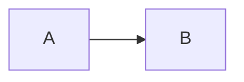

# WeCan Wiki - IT 知识库系统

<div align="center">

📚 一个现代化的、功能完整的 IT 知识库 Wiki 系统

[](LICENSE)
[](https://www.docker.com/)
[](https://nextjs.org/)
[](https://www.mongodb.com/)

[特性](#特性) • [快速开始](#快速开始) • [部署指南](#部署指南) • [使用说明](#使用说明) • [技术栈](#技术栈)

</div>

---

## 📖 项目简介

WeCan Wiki 是一个基于 Next.js + MongoDB 构建的现代化 IT 知识库系统，专为企业和个人设计，用于组织、管理和分享 IT 技术知识。系统采用 Docker 容器化部署，支持一键部署到云服务器。

### ✨ 主要特性

- 🎯 **完整的知识分类体系**: 覆盖 IT 所有领域（编程语言、Web 开发、数据库、云计算等）
- 📝 **Markdown 编辑器**: 支持实时预览、代码高亮、数学公式、Mermaid 图表
- 🔍 **强大的全文搜索**: 基于 MeiliSearch，毫秒级搜索响应
- 👥 **多角色权限系统**: Super Admin / Admin / Editor / Author / Viewer
- 🐳 **Docker 一键部署**: 包含所有依赖服务，5 分钟即可上线
- 🎨 **现代化 UI**: 响应式设计、深色模式、主题定制
- 📊 **Web 管理后台**: 可视化的内容管理，非技术人员也能轻松使用
- 🔗 **第三方集成**: 支持导入 Notion、语雀等内容
- 📦 **版本控制**: 文档版本管理，可随时回滚
- 🔒 **安全可靠**: RBAC 权限控制、审计日志、数据备份

---

## 🏗️ 系统架构

```
┌─────────────────────────────────────────┐
│           Nginx (反向代理)               │
│              Port: 80/443               │
└───────────────┬─────────────────────────┘
                │
    ┌───────────┴───────────┐
    │                       │
┌───▼───────┐       ┌──────▼──────┐
│ Frontend  │       │   Backend   │
│ Next.js   │       │  Node.js    │
│ Port 3000 │       │  Port 3001  │
└───────────┘       └──────┬──────┘
                           │
              ┌────────────┴────────────┐
              │                         │
        ┌─────▼─────┐           ┌──────▼──────┐
        │ MongoDB   │           │ MeiliSearch │
        │ Database  │           │  Search     │
        └───────────┘           └─────────────┘
```

---

## 🛠️ 技术栈

### 前端
- **框架**: Next.js 14 (App Router)
- **语言**: TypeScript 5.x
- **UI 组件**: Shadcn/ui + Tailwind CSS
- **状态管理**: Zustand
- **Markdown**: react-markdown + remark-prism
- **HTTP 客户端**: Axios + TanStack Query

### 后端
- **运行时**: Node.js 20 LTS
- **框架**: Koa.js
- **ORM**: Mongoose
- **认证**: JWT
- **文件存储**: MinIO

### 基础设施
- **数据库**: MongoDB 7.x
- **搜索引擎**: MeiliSearch
- **反向代理**: Nginx
- **容器化**: Docker + Docker Compose

---

## 🚀 快速开始

### 前置要求

- Docker 20.10+
- Docker Compose 2.0+
- Git

### 1. 克隆项目

```bash
git clone https://github.com/your-org/wican-wiki.git
cd wican-wiki
```

### 2. 配置环境变量

```bash
cp .env.example .env
```

编辑 `.env` 文件，修改必要的配置：

```bash
# 生成安全的 JWT Secret
JWT_SECRET=your_secure_random_string_minimum_32_characters

# 修改数据库密码
MONGO_PASSWORD=your_secure_password

# 修改搜索引擎密钥
MEILI_MASTER_KEY=your_master_key
```

### 3. 一键启动

```bash
# 赋予执行权限
chmod +x deploy.sh

# 运行部署脚本
./deploy.sh
```

部署完成后，访问：
- **首页**: http://localhost
- **管理后台**: http://localhost/admin
- **API 测试**: http://localhost/api/v1/test

### 4. 默认账户

```
用户名：admin
密码：admin123
⚠️ 首次登录后请立即修改密码！
```

---

## 📦 部署指南

### 本地开发环境

```bash
# 前端开发
cd frontend
npm install
npm run dev

# 后端开发
cd backend
npm install
npm run dev
```

### 云服务器部署（推荐）

#### Ubuntu/CentOS

```bash
# 1. 安装 Docker
curl -fsSL https://get.docker.com | bash

# 2. 安装 Docker Compose
curl -L "https://github.com/docker/compose/releases/latest/download/docker-compose-$(uname -s)-$(uname -m)" -o /usr/local/bin/docker-compose
chmod +x /usr/local/bin/docker-compose

# 3. 克隆项目
git clone https://github.com/your-org/wican-wiki.git
cd wican-wiki

# 4. 配置环境变量
cp .env.example .env
# 编辑 .env 文件，修改配置

# 5. 一键部署
./deploy.sh
```

#### 配置 HTTPS（生产环境）

1. 获取 SSL 证书（Let's Encrypt 或购买）
2. 将证书文件放入 `nginx/ssl/` 目录
3. 修改 `nginx/nginx.conf`，启用 HTTPS 配置块
4. 重启服务：`docker-compose restart nginx`

### 环境变量说明

| 变量名 | 说明 | 默认值 |
|--------|------|--------|
| `NODE_ENV` | 运行环境 | `production` |
| `DATABASE_URL` | MongoDB 连接地址 | `mongodb://mongodb:27017/wikan` |
| `MEILI_MASTER_KEY` | MeiliSearch 主密钥 | (必须设置) |
| `JWT_SECRET` | JWT 加密密钥 | (必须设置，至少 32 字符) |
| `MINIO_ACCESS_KEY` | MinIO 访问密钥 | `minioadmin` |
| `MINIO_SECRET_KEY` | MinIO 秘密密钥 | `minioadmin_secret` |

---

## 📖 使用说明

### 知识分类体系

系统预置了完整的 IT 知识分类：

```
📚 基础理论
├── 计算机科学基础
├── 软件工程
└── 数学基础

💻 编程语言
├── JavaScript/TypeScript
├── Python
├── Java
├── Go
└── Rust

🌐 Web 开发
├── 前端开发 (React/Vue/Angular)
├── 后端开发 (Node.js)
└── 全栈开发

🗄️ 数据库
├── MySQL
├── PostgreSQL
├── MongoDB
└── Redis

☁️ 云计算与 DevOps
├── Docker
├── Kubernetes
└── CI/CD

🔒 网络安全
├── 应用安全
├── 网络安全
└── 合规标准

... 更多分类
```

### 管理后台功能

#### 1. 文档管理
- ✅ 创建/编辑/删除文档
- ✅ Markdown 双栏预览
- ✅ 版本历史对比
- ✅ 批量操作
- ✅ 草稿箱

#### 2. 分类管理
- ✅ 树形结构编辑
- ✅ 拖拽排序
- ✅ 分类合并/拆分

#### 3. 用户管理
- ✅ 用户列表
- ✅ 角色分配
- ✅ 权限设置

#### 4. 媒体库
- ✅ 图片上传
- ✅ 文件管理
- ✅ CDN 配置

### Markdown 语法支持

```markdown
# 标题
**粗体** *斜体* ~~删除线~~
- 列表项
- 列表项

[链接](url)


```javascript
// 代码块支持语法高亮
const hello = "world";
```

> 引用块

| 表格 | 示例 |
|------|------|
| 单元格 | 内容 |



$$ E = mc^2 $$
```

---

## 🔧 常见问题

### Q: 如何添加新的知识分类？

A: 
1. 登录管理后台
2. 进入「分类管理」
3. 点击「新建分类」
4. 填写分类信息并保存

### Q: 如何导入外部文档？

A: 
1. 准备 Markdown 格式文档
2. 在管理后台选择「批量导入」
3. 上传文件或粘贴内容
4. 选择目标分类和标签

### Q: 如何配置自定义域名？

A:
1. 在 DNS 服务商处添加 A 记录指向服务器 IP
2. 修改 `nginx/nginx.conf` 中的 `server_name`
3. 重新加载 Nginx: `docker-compose restart nginx`

### Q: 数据如何备份？

A:
```bash
# 导出 MongoDB 数据
docker-compose exec mongodb mongodump --out=/backup

# 下载备份文件
docker cp mongodb:/backup ./local-backup

# 恢复数据
docker-compose exec mongodb mongorestore /backup
```

### Q: 忘记管理员密码怎么办？

A:
```bash
# 进入 MongoDB 容器
docker-compose exec mongodb mongosh

# 重置密码
use wikan
db.users.updateOne(
  { username: "admin" },
  { $set: { password: "$2a$10$LgQkXhQ5Z5Z5Z5Z5Z5Z5Z5Z5Z5Z5Z5Z5Z5Z5Z5Z5Z5Z5Z5Z5Z5Z5Z" } }
)
# 新密码：admin123
```

---

## 📊 API 接口

### RESTful API v1

```
GET    /api/v1/documents          # 获取文档列表
POST   /api/v1/documents          # 创建文档
GET    /api/v1/documents/:slug    # 获取文档详情
PUT    /api/v1/documents/:id      # 更新文档
DELETE /api/v1/documents/:id      # 删除文档

GET    /api/v1/categories         # 获取分类树
POST   /api/v1/categories         # 创建分类

GET    /api/v1/search?q=keyword   # 搜索文档

POST   /api/v1/auth/login         # 登录
POST   /api/v1/auth/register      # 注册
POST   /api/v1/auth/logout        # 登出
```

详细 API 文档：`http://localhost/api-docs`

---

## 🤝 贡献指南

欢迎提交 Issue 和 Pull Request！

1. Fork 本仓库
2. 创建特性分支 (`git checkout -b feature/AmazingFeature`)
3. 提交更改 (`git commit -m 'Add some AmazingFeature'`)
4. 推送到分支 (`git push origin feature/AmazingFeature`)
5. 开启 Pull Request

---

## 📄 开源协议

MIT License

---

## 📞 联系方式

- **项目地址**: https://github.com/your-org/wican-wiki
- **问题反馈**: https://github.com/your-org/wican-wiki/issues
- **邮箱**: support@wikan.com

---

## 🙏 致谢

感谢以下开源项目：

- [Next.js](https://nextjs.org/)
- [MongoDB](https://www.mongodb.com/)
- [MeiliSearch](https://www.meilisearch.com/)
- [Shadcn/ui](https://ui.shadcn.com/)
- [Tailwind CSS](https://tailwindcss.com/)

---

<div align="center">

**⭐ 如果这个项目对你有帮助，请给一个 Star 支持！⭐**

Made with ❤️ by WeCan Team

</div>
